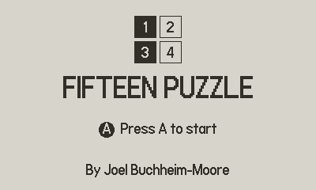
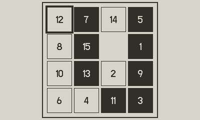
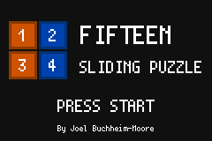
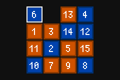

# Fifteen Puzzle

## Setup

- [Rust](https://rustup.rs/) (stable toolchain)
- [cargo-make](https://github.com/sagiegurari/cargo-make): `cargo install cargo-make`
- Copy `example.env` to `.env` and fill in your own values (device IDs, signing keystore path/
  password, etc.):
  ```
  cp example.env .env
  ```

Additional per-platform requirements are listed in each section below.

## Controls

Both frontends share the same controls:

- **Arrow keys** — slide a tile into the blank space
- **Click/tap a tile** — slide it (and any tiles between it and the blank) toward the blank
- **N** — start a new game
- **Q** / **Esc** — quit (CLI only; the GUI has its own menu)

## CLI

Build and run:

```
cargo run -p cli
```

Install as a standalone `fifteen` command:

```
cargo install --path cli
```

## Desktop

```
cargo make desktop            # debug build, runs immediately
cargo make desktop-release    # release build
```

## Web

Requires [Trunk](https://trunkrs.dev/): `cargo install trunk`

```
cargo make web          # release build, output in gui/dist/
cargo make web-serve     # dev server with live rebuild
```

## iOS

Requires Xcode, a configured Apple developer signing team, and the `ios/FifteenPuzzle` Xcode
project linked against the Rust static library.

Build:

```
cargo make ios
```

Build, install, and launch on a connected iPhone:

```
cargo make ios-run-device
```

Needs `IOS_DEVICE_ID` set in `.env` (from `xcrun devicectl list devices`), or passed inline:
`IOS_DEVICE_ID=<id> cargo make ios-run-device`.

## Android

Requires the Android SDK Platform (API 33) and NDK via Android Studio's SDK Manager, plus
`ANDROID_HOME`, `ANDROID_NDK_HOME`, and `JAVA_HOME` environment variables set.

Build:

```
cargo make android            # debug APK
cargo make android-release    # release APK (needs a signing keystore)
```

`android-release`/`android-run-release` need a signing keystore. Set `CARGO_APK_RELEASE_KEYSTORE`
and `CARGO_APK_RELEASE_KEYSTORE_PASSWORD` in `.env` rather than committing them to
`gui/Cargo.toml`.

Build, install, and launch on a connected device/emulator:

```
cargo make android-run
cargo make android-run-release
```

## macOS app bundle

Requires [cargo-bundle](https://github.com/burtonageo/cargo-bundle) (installed automatically if
missing).

Build:

```
cargo make macos-bundle    # produces target/release/bundle/osx/Fifteen Puzzle.app
```

Build and install to `/Applications`:

```
cargo make macos-install
```

## Linux (.deb package)

Requires [cargo-deb](https://github.com/kornelski/cargo-deb) (installed automatically if
missing). Must be built on Linux, not cross-compiled from macOS.

Build:

```
cargo make linux-deb    # produces target/debian/*.deb
```

Build and install with `dpkg` (asks for sudo):

```
cargo make linux-deb-install
```

## Playdate




`cargo make playdate-tool` installs the `cargo-playdate` CLI straight from
[joelbm24/playdate](https://github.com/joelbm24/playdate) (a fork of
[boozook/playdate](https://github.com/boozook/playdate)) - no local checkout needed for that part.
Also needs the nightly toolchain, since the fork's own dependencies use unstable features
unconditionally, and the Cortex-M7 device target (`cargo make playdate-target` installs
`thumbv7em-none-eabihf` + `rust-src`).

Run in the Simulator (debug):

```
cargo make playdate-sim
```

Build, install, and run on a connected device (must be awake and mounted over USB; if you have more
than one connected, target a specific one with `PLAYDATE_SERIAL_DEVICE=<serial>`):

```
cargo make playdate-device
```

**Controls:**

- **D-pad** — moves the selection cursor by default; press A to slide the highlighted tile toward the
  blank. Switch to directly sliding tiles with the D-pad instead via the system menu → **Input** →
  **Arrows**.
- **A** — begin from the title screen, slide the selected/highlighted tile (Cursor mode), or start a
  new game once solved
- **System menu → New Game** — reshuffle at any time

## Game Boy Advance




Built on the [agb](https://agbrs.dev) crate. Needs the nightly toolchain (pinned by
`gba/rust-toolchain.toml`) with `rust-src` (`cargo make gba-target` installs it) - agb's
`thumbv4t-none-eabi` target isn't built into rustc, it's built from source via `-Z build-std`. Also
needs [mGBA](https://mgba.io) on `PATH` to run the debug build - the binary is just `mgba` on macOS,
though some Linux packages install it as `mgba-qt` instead (update the runner in
`gba/.cargo/config.toml` if yours differs).

Build and run in mGBA (debug):

```
cargo make gba
```

Build an optimized ROM (`target/thumbv4t-none-eabi/release/fifteen-gba.gba`, ready for real hardware
or a release-mode emulator run):

```
cargo make gba-release
```

**Controls:**

- **D-pad** — moves the selection cursor around the board
- **A** — slides the tile under the cursor toward the blank (if aligned), or starts a new game once
  solved
- **Start** — begins the game from the title screen; pauses mid-game with a **New Game**/**Close**
  menu (D-pad Up/Down to choose, A to confirm)
- **B** — closes the pause menu without changing anything
